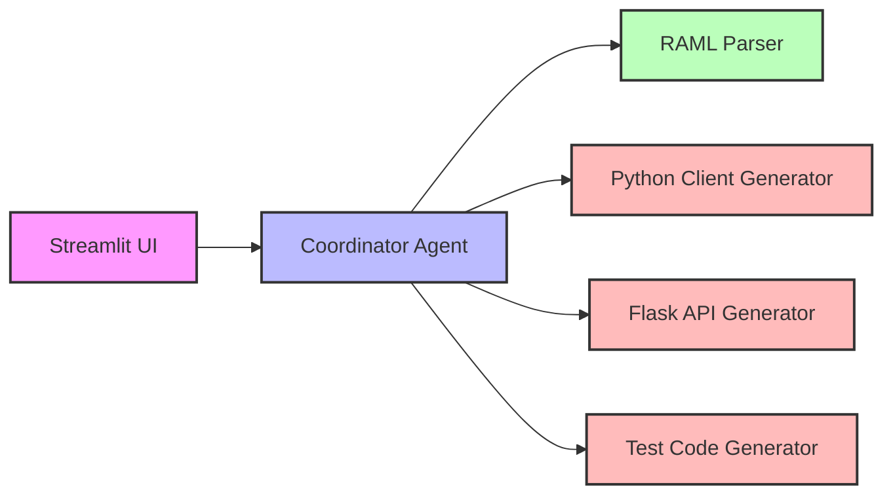

# Agentic API Forge

## Features
RAML Parsing: Parses RAML files including support for !include directives
Python Client Generation: Creates Python client libraries with request methods for each API endpoint
Flask API Generation: Produces Flask applications with SQLAlchemy models and route handlers
Test Code Generation: Generates PyTest code for API testing
User-Friendly Interface: Simple Streamlit-based UI for easy interaction

## Installation

### Prerequisites
Python 3.8 or higher
pip (Python package installer)

### Setup
Clone the repository:
git clone https://github.com/yourusername/agentic-api-forge.git
cd agentic-api-forge

Create a virtual environment:
python -m venv venv
source venv/bin/activate  # On Windows: venv\Scripts\activate

Install dependencies:
pip install -r requirements.txt

### Usage
Start the application:
streamlit run main.py

Open your web browser and navigate to the URL shown in the terminal (typically http://localhost:8501)

Upload your RAML file using the file uploader

The base directory for resolving !include directives will be automatically set to your current working directory. You can modify this if needed.

Select which components you want to generate:

Python Client
Flask API
Tests
Click "Generate Code" and wait for the process to complete

View and download the generated code

### Architecture

Agentic API Forge follows an agent-based architecture:


### Components

Streamlit UI: User interface for file upload and code generation options
Coordinator Agent: Orchestrates the parsing and code generation process
RAML Parser: Parses RAML files into structured data
Python Client Generator: Generates Python client code
Flask API Generator: Generates Flask API code with SQLAlchemy models
Test Code Generator: Generates PyTest code for API testing

### Project Structure
```code
agentic-api-forge/
├── main.py                  # Main application entry point
├── requirements.txt         # Python dependencies
├── agents/
│   ├── __init__.py
│   ├── coordinator.py       # Coordinator agent
│   └── base.py              # Base agent class
├── core/
│   ├── __init__.py
│   ├── parser.py            # RAML parser
│   └── generators/
│       ├── __init__.py
│       ├── base.py          # Base code generator
│       ├── client.py        # Python client generator
│       ├── flask.py         # Flask API generator
│       └── test_generator.py # Test code generator
└── ui/
    ├── __init__.py
    └── streamlit_app.py     # Streamlit UI
```
    

### Example

Input: RAML File
#%RAML 1.0
title: Example API
version: v1
baseUri: https://api.example.com/{version}
mediaType: application/json

/users:
  get:
    description: Get all users
    responses:
      200:
        body:
          application/json:
            example: |
              [
                {"id": 1, "name": "John Doe", "email": "john@example.com"},
                {"id": 2, "name": "Jane Smith", "email": "jane@example.com"}
              ]
  post:
    description: Create a new user
    body:
      application/json:
        example: |
          {"name": "New User", "email": "new@example.com"}
    responses:
      201:
        body:
          application/json:
            example: |
              {"id": 3, "name": "New User", "email": "new@example.com"}

  /{userId}:
    get:
      description: Get a specific user
      responses:
        200:
          body:
            application/json:
              example: |
                {"id": 1, "name": "John Doe", "email": "john@example.com"}

### Output: Generated Code

The application will generate:

Python client code
Flask API implementation
PyTest test code

### Contributing
Contributions are welcome! Please feel free to submit a Pull Request.

Fork the repository
Create your feature branch (git checkout -b feature/amazing-feature)
Commit your changes (git commit -m 'Add some amazing feature')
Push to the branch (git push origin feature/amazing-feature)
Open a Pull Request

### License

This project is licensed under the MIT License - see the LICENSE file for details.

### Acknowledgments
RAML - RESTful API Modeling Language
Streamlit - The fastest way to build data apps
Flask - Python web framework
SQLAlchemy - SQL toolkit and ORM for Python

### Troubleshooting
Common Issues
Error: Failed to parse RAML content

Ensure your RAML file is valid
Check that the base directory is correctly set for resolving !include directives
Error: Code generation failed

Check the error message for specific details
Ensure your RAML file contains all required information for the selected generators
Browser tab shows "Streamlit" instead of "Agentic API Forge"

Clear your browser cache
Try opening the app in an incognito/private window

### Getting Help

If you encounter any issues not covered in this documentation, please open an issue on the GitHub repository.

# Agenticapiforge

## Description

[Briefly describe your project here.]

## Installation


1.  **Initialize git (Windows):**
    Run the `000_init.bat` file.

2.  **Create a virtual environment (Windows):**
    Run the `001_env.bat` file.

3.  **Activate the virtual environment (Windows):**
    Run the `002_activate.bat` file.

4.  **Install dependencies:**
    Run the `003_setup.bat` file. This will install all the packages listed in `requirements.txt`.

5.  **Deactivate the virtual environment (Windows):**
    Run the `005_deactivate.bat` file.

## Usage

1.  **Run the main application (Windows):**
    Run the `004_run.bat` file.

    [Provide instructions on how to use your application.]

## Batch Files (Windows)

This project includes the following batch files to help with common development tasks on Windows:

* `000_init.bat`: Initialized git and also usn and pwd config setup also done.
* `001_env.bat`: Creates a virtual environment named `venv`.
* `002_activate.bat`: Activates the `venv` virtual environment.
* `003_setup.bat`: Installs the Python packages listed in `requirements.txt` using `pip`.
* `004_run.bat`: Executes the main Python script (`main.py`).
* `005_run_test.bat`: Executes the pytest  scripts (`test_main.py`).
* `008_deactivate.bat`: Deactivates the currently active virtual environment.

## Contributing

[Explain how others can contribute to your project.]

## License

[Specify the project license, if any.]
